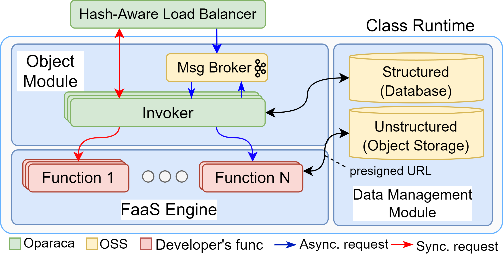

= Oparaca
:toc:
:toc-placement: preamble
:toclevels: 2

// Need some preamble to get TOC:
{empty}

image:https://github.com/hpcclab/OaaS/actions/workflows/platform-container-build.yml/badge.svg?branch=main[link="https://github.com/hpcclab/OaaS/actions/workflows/platform-container-build.yml"]
image:https://jitpack.io/v/hpcclab/OaaS.svg[link="https://jitpack.io/#hpcclab/OaaS"]

== Introduction
=== What is Oparaca?
Oparaca (**O**bject **Para**digm on Serverless **C**loud **A**bstraction) is the implementation of Object-as-a-Service (OaaS) paradigm

=== What is OaaS?

Object as a Service (OaaS) is a new serverless paradigm, that borrows the object-oriented programming concepts to encapsulate application logic and data in addition to non-functional requirements (QoS and constraints) into a single deployment package, thereby, streamlining cloud-native application development.

.FaaS
image::doc/diagrams/faas_concept_v4s.dio.png[faas_concept,480]
.OaaS
image::doc/diagrams/oaas_concept_v5.dio.png[ oaas_concept,480]

== Architecture
.Overall Architecture
image::doc/diagrams/qos_oaas_architecture_v15_1.dio.png[architecture1,480]
.Class Runtime Architecture

== Getting start with Dev mode for local development

Oparaca came with `ocli` commandline tool with the dev mode for local development.  This Dev mode allow to interact with Oparaca similar to the cluster mode but without the need of Kubernetes.

Check on the guides:

* link:cli/README.adoc[ocli installation and usage guide]
* link:doc/FUNCTION_GUIDE.adoc[function development]
* link:doc/PACKAGE_REFERENCE.adoc[package definition guide]

== Deploying the Oparaca platform in Kubernetes

Check on the guides:

* link:deploy/local-k8s/README.adoc[Installing *Oparaca* on local Kubernetes] (ex. kind, k3d, Docker Desktop, Rancher Desktop).

* link:example/README.adoc[Example usages in Oparaca cluster].

// == Demo
//
// * Demo
// +
// image::https://asciinema.org/a/zdLjJ77dNEKvEKrghHQzyFahx.svg[link=https://asciinema.org/a/zdLjJ77dNEKvEKrghHQzyFahx]

== Publication

* Lertpongrujikorn, Pawissanutt, and Mohsen Amini Salehi. "Object as a service (oaas): Enabling object abstraction in serverless clouds." 2023 IEEE 16th International Conference on Cloud Computing (CLOUD). IEEE, 2023.
(https://ieeexplore.ieee.org/abstract/document/10254994[link])

