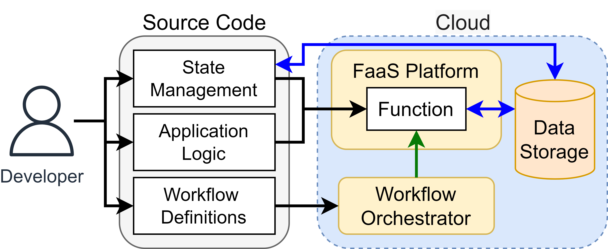
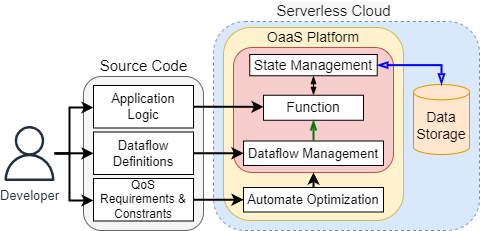
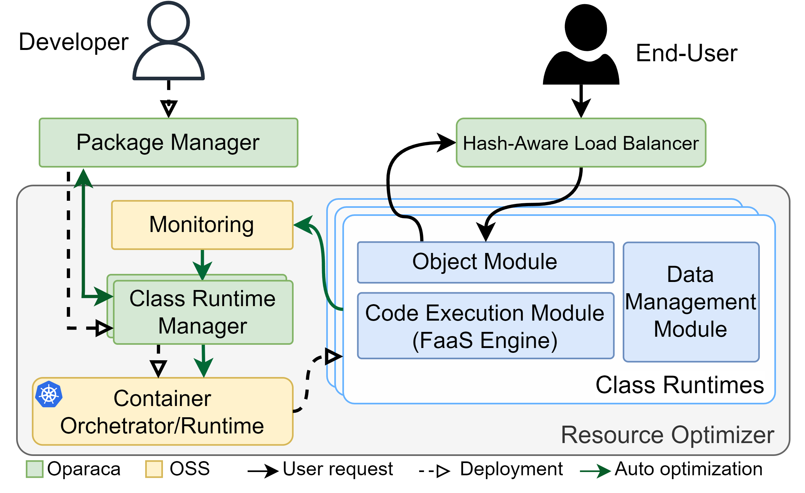
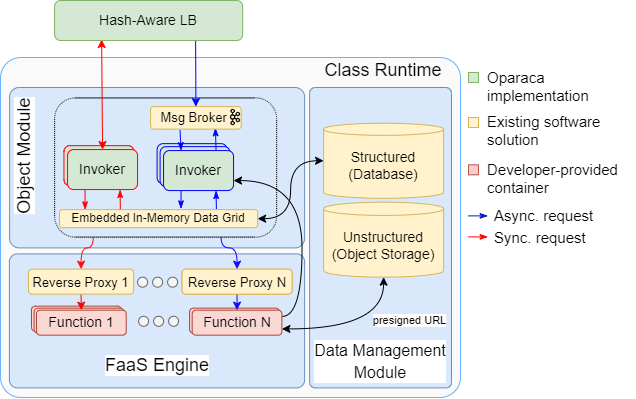

= OaaS
:toc:
:toc-placement: preamble
:toclevels: 2

// Need some preamble to get TOC:
{empty}

image:https://github.com/hpcclab/OaaS/actions/workflows/platform-container-build.yml/badge.svg?branch=main[link="https://github.com/hpcclab/OaaS/actions/workflows/platform-container-build.yml"]
image:https://jitpack.io/v/hpcclab/OaaS.svg[link="https://jitpack.io/#hpcclab/OaaS"]

== Introduction
=== What is OaaS?

OaaS is a shortened word for Object as a Service, a new serverless paradigm. OaaS utilizes the notion of Object to incorporate state management into the Serverless platform.

.FaaS

.OaaS

== Architecture
.Overall Architecture

.Class Runtime Architecture

== Try it via k3d

Check on link:deploy/local-k8s/README.adoc[this guide] to install *OaaS* on local Kubernetes (ex. kind, k3d, Docker Desktop).

== OaaS Usage

* link:example/README.adoc[The example usage guide]
// * link:doc/OAI.adoc[The detail of Object Access Interface (OAI)].
* link:cli/README.adoc[Command Line Interface]
* Demo
+
image::https://asciinema.org/a/zdLjJ77dNEKvEKrghHQzyFahx.svg[link=https://asciinema.org/a/zdLjJ77dNEKvEKrghHQzyFahx]

== Publication

* Lertpongrujikorn, Pawissanutt, and Mohsen Amini Salehi. "Object as a service (oaas): Enabling object abstraction in serverless clouds." 2023 IEEE 16th International Conference on Cloud Computing (CLOUD). IEEE, 2023.
(https://ieeexplore.ieee.org/abstract/document/10254994[link])
