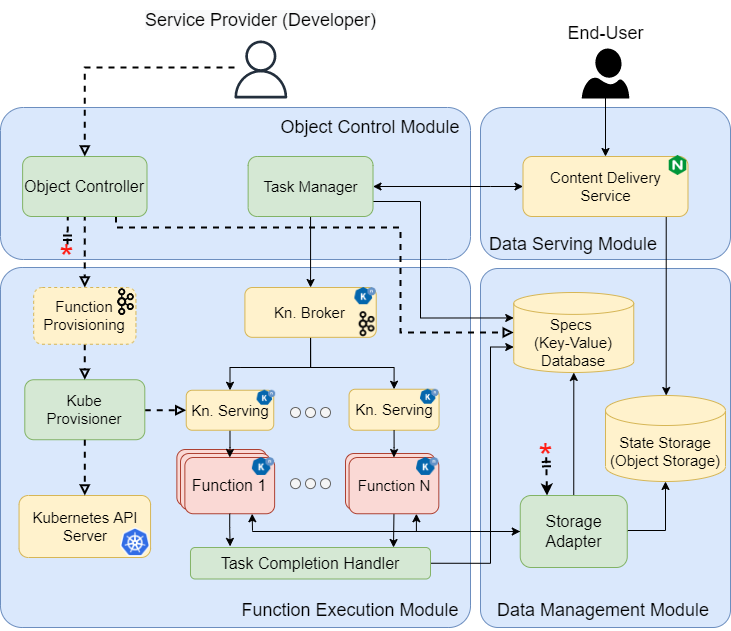

= OaaS
:toc:
:toc-placement: preamble
:toclevels: 2

// Need some preamble to get TOC:
{empty}

image:https://github.com/hpcclab/OaaS/actions/workflows/container-build-main.yml/badge.svg?branch=main[link="https://github.com/hpcclab/OaaS/actions/workflows/container-build-main.yml"]
image:https://jitpack.io/v/hpcclab/OaaS.svg[link="https://jitpack.io/#hpcclab/OaaS"]

== Introduction
=== What is OaaS?

OaaS is a shortened word for Object as a Service, a new serverless paradigm. OaaS utilizes the notion of Object to incorporate state management into the Serverless platform.

image:doc/diagrams/oaas_concept_all_v1.dio.png[
concept,480]

== Architecture

== OaaS Installation

NOTE: Go through  link:deploy/oaas-single-node/README.adoc[this guide] to try *OaaS* on single node Kubernetes (ex. Minikube, Docker Desktop).

=== Prerequisites
* Kubernetes Cluster (at least 3 node if you plan to using https://rook.io/[Rook])
* https://knative.dev/docs/[Knative] (Both Serving and Eventing)
* S3-compatible storage (ex. https://rook.io/[Rook], https://min.io/[MinIO])
* Operators
** operator to deploy Kafka (https://strimzi.io/[Strimzi Operator])
** operator to deploy Infinispan (https://infinispan.org/docs/infinispan-operator/2.2.x/operator.html[Infinispan Operator])

=== Edit configuration
First, you need to clone this project.
[source,bash]
----
git clone https://github.com/hpcclab/OaaS.git
----

Overall, the default configuration should be able to use as it is (except `sa.yml`). If you have the deference cluster setup you may need to change the following configurations:

* An unified configuration of OaaS components: link:deploy/oaas/base/env-configmap.yaml[]
* A Storage Adapter configuration: link:deploy/oaas/base/sa.yml[]
+
We make these configuration files by assuming the cluster relies on Rook to provide object storage. In case that you are not using Rook, you have to customize the environment variable section in `sa.yml` to match your object storage.
+
*In any case, you still have to change* `OAAS_SA_S3_PUBLICURL` environment variable in `sa.yml` to your public domain of your object storage.

=== Deployment

. Create a new Kubernetes namespace
+
[source,bash]
----
kubectl create ns msc
----

. Deploy kafka via a following command.
+
[source,bash]
----
kubectl apply -f deploy/kafka/kafka-cluster.yml
----

. Wait until Kafka cluster is ready.
+
[source,bash]
----
kubectl get -w pod
----

. Deploy Knative broker
+
[source,bash]
----
kubectl apply -f deploy/knative/
----

. Deploy an object bucket. (In case you are using Rook)
+
[source,bash]
----
kubectl apply -f deploy/oaas/object-bucket.yml
----

. Deploy the OaaS platform.
+
[source,bash]
----
kubectl apply -k deploy/oaas/base
----

. Expose the OaaS API. This step is depend on your cluster setup. We provide the example configuration for exposing the API using Ingress. You have to edit the hostname to suit your cluster setup.
+
[source,yaml]
----
apiVersion: networking.k8s.io/v1
kind: Ingress
metadata:
  name: oaas-ingress
spec:
  rules:
    - host: "oc.oaas.10.131.36.40.nip.io"
      http:
        paths:
          - pathType: Prefix
            path: /
            backend:
              service:
                name: object-controller
                port:
                  number: 80
    - host: "tm.oaas.10.131.36.40.nip.io"
      http:
        paths:
          - pathType: Prefix
            path: /
            backend:
              service:
                name: task-manager
                port:
                  number: 80
    - host: "cds.oaas.10.131.36.40.nip.io"
      http:
        paths:
          - pathType: Prefix
            path: /
            backend:
              service:
                name: content-delivery-service
                port:
                  number: 80

----
+
Then, you need to save this into a file and submit it to Kubernetes using the following command.
+
[source,bash]
----
kubectl apply -f oaas-ingress.yml
----

== OaaS Usage

* link:example/README.adoc[The example usage guide]
* link:doc/OAI.adoc[The detail of Object Access Interface (OAI)].
