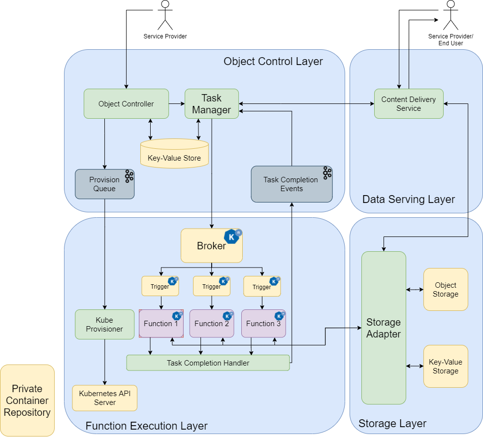
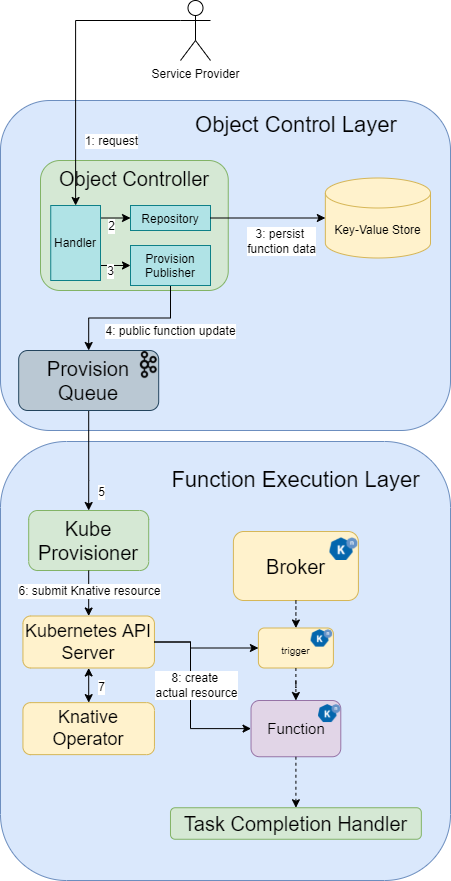

= OaaS
:toc:
:toc-placement: preamble
:toclevels: 2

// Need some preamble to get TOC:
{empty}

== Architecture
=== High Level

=== Flow
==== Development

==== Execution
image:doc/diagrams/oaas_flow_function_exec_v2_1.dio.png[]
