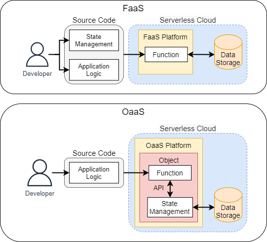

= OaaS
:toc:
:toc-placement: preamble
:toclevels: 2

// Need some preamble to get TOC:
{empty}

image:https://github.com/hpcclab/OaaS/actions/workflows/container-build-main.yml/badge.svg?branch=main[]

== Introduction
=== What is OaaS?

OaaS is a shortened word for Object as a Service, a new serverless paradigm. OaaS utilizes the notion of Object to incorporate state management into the Serverless platform.

== Architecture
image:doc/diagrams/oaas_architecture_v6.dio.png[]

== OaaS Installation
=== Prerequisites
* Kubernetes Cluster
* https://knative.dev/docs/[Knative]
* S3-compatible storage (ex. https://rook.io/[Rook], https://min.io/[MinIO])
* Operators
** https://strimzi.io/[Strimzi Operator]
** https://infinispan.org/docs/infinispan-operator/2.2.x/operator.html[Infinispan Operator]

=== Edit configuration
* link:deploy/oaas/base/env-configmap.yaml[]

NOTE: We make these configuration files to use Rook to provide object storage. In case that you are not using Rook, you have to customize the link:deploy/oaas/base/sa.yml[SA] configuration to match yours.

=== Deployment

. Deploy kafka via a following command.
+
[source,bash]
----
kubectl apply -f deploy/kafka/kafka-cluster.yml
----

. Wait until Kafka cluster is ready.
+
[source,bash]
----
kubectl get -w pod
----

. Deploy Knative broker
+
[source,bash]
----
kubectl apply -f deploy/knative/broker.yml
----

. Deploy an object bucket. (In case you are using Rook)
+
[source,bash]
----
kubectl apply -f deploy/oaas/object-bucket.yml
----

. Deploy the OaaS platform.
+
[source,bash]
----
kubectl apply -k deploy/oaas/base
----

== OaaS Usage

link:example/README.adoc[Example usage guide]
