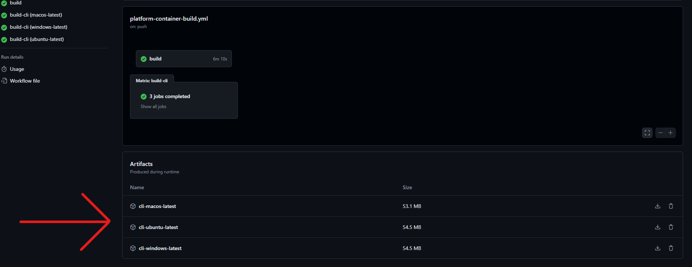
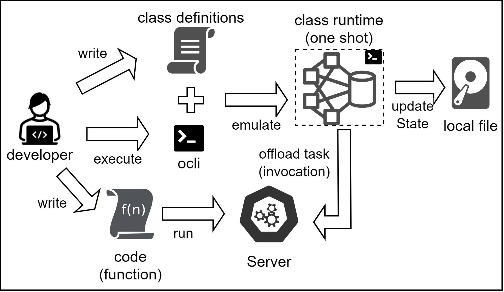
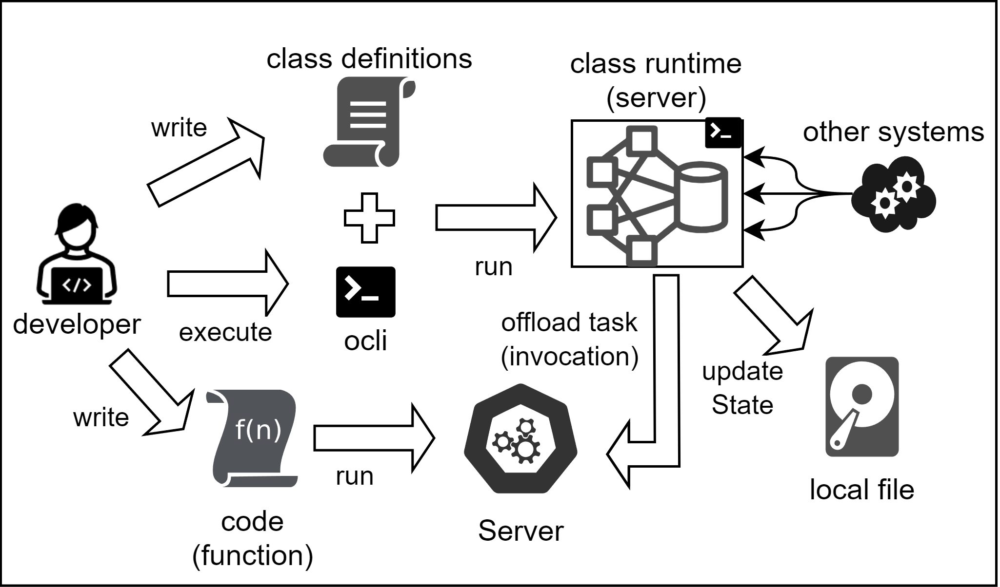

= Oparaca CLI (OCLI)
:toc:
:toc-placement: preamble
:toclevels: 2

// Need some preamble to get TOC:
{empty}

The commandline interface for Oparaca.

== Installation

=== Download from GitHub Action

Download the executable file from the artifacts of GitHub Action buid (https://github.com/hpcclab/OaaS/actions/workflows/platform-container-build.yml[link]). They are usually in the bottom of summary page. Then, copy the executable file to any directory that assigned to PATH variable (ex. `/usr/local/bin`).

=== Build from source

==== Native Image
The native image is preferable than the jar file because it has a much faster startup time. First, make sure to install the prerequisite programs for GraalVM. You can check on the prerequisites section of this link:https://quarkus.io/guides/building-native-image[guide].

[source,bash]
----
# FIRST BUILD MAIN PROJECT
./mvnw install -DskipTests
cd cli

# BUILD NATIVE IMAGE
just build-native
# OR
./mvnw install -Pnative -DskipTests
----
NOTE: For Windows user, there is some issue that the Microsoft Native Tools for Visual Studio must first be initialized before packaging. You can work around by run the following command instead: `just build-native-window`

Then, copy the output binary to any directory that assigned to PATH variable (ex. `/usr/local/bin`).

[source,bash]
----
# THEN COPY TO LOCAL BIN
cp target/oprc-cli-999-SNAPSHOT-runner $HOME/.local/bin/ocli
# OR IF YOU PREFER TO INSTALL AT SYSTEM LEVEL
sudo cp target/oprc-cli-999-SNAPSHOT-runner /usr/local/bin/ocli
# FOR WINDOW USER YOU CAN SIMPLY MOVE IT TO ANYWHERE THAT IS REGISTERED IN PATH VARIABLE
# FOR EXAMPLE
cp  target/oprc-cli-999-SNAPSHOT-runner.exe $HOME/.local/bin/ocli.exe
----

==== Jar file via JBang
You can install this cli by using https://www.jbang.dev/[jbang] and run the following command

[source,bash]
----
./mvnw package -DskipTests
cd cli
jbang app install --name=ocli --force target/quarkus-app/quarkus-run.jar
----

== Usage
You can check the usage instruction by running `ocli -h`.

EXAMPLE
[source,bash]
----
# CONFIG THE CONNECTION
ocli ctx set --inv=http://inv.oaas.127.0.0.1.nip.io --pm=http://pm.oaas.127.0.0.1.nip.io
# DEPLOY PACKAGE
ocli p a example/pkg/record.yml
# CREATE OBJECT AND SAVE OBJECT ID FOR LATER USE (SAVE TO LOCAL CONFIG FILE)
ocli o c example.record -s
# INVOKE FUNCTION to a saved object
ocli i2 random
----

== Local Development (Dev Mode)

You can run `ocli` in the emulator mode for the local development.
[source,bash]
----
ocli dev -h
----

In thie mode, you can:

* apply package
* create object
* invoke object function
** If you invoke the custom function, you can configure `ocli` to offload the task to your function that run locally.

The state will be keep in the local file storage. By the default, it will store at `%HOME/.oprc/local`. You can configure the location by editing `$HOME/.oprc/config.yml`.

=== Common Usages

[source,bash]
----
docker compose up -d json-update-fn
----

Example:
[source,bash]
----

# Apply package to local
ocli dev pa example/pkg/record.yml

# Create object to local
ocli dev oc example.record -s -d '{"hello":"world"}'
----

=== One-shot Invocation

.Dev-mode: one-shot invocation

You can invoke the object function via below command. `ocli` will offload the task into your function server, based on the configuration.

Suppose you have the function run at http://localhost:10001.
In this example, we can start json-update-fn locally via docker.

[source,bash]
----
# First, configure function URL
ocli dev conf --fn-dev-url "http://localhost:10001"
# Invoke the object function
ocli dev i random -s
----

=== Run as server

.Dev-mode: ran as server

In the case that you want to access the OaaS invocation API via your own code, you can run `ocli` to emulate the class runtime server.

[source,bash]
----
ocli dev server
# terminate server by ctrl+c
----

When terminated the program, it will write the new object data to local file as same as `ocli dev i` command.

NOTE: If you update the configuration, you have to restart the server for it to reflect on the configuration.

=== Unstructured Data
Currently, `ocli` not provide the object storage emulation out of the box. You have to run the local object storage manually.
[source,bash]
----
docker run -d -p 9000:9000 -p 9001:9001 -e MINIO_ROOT_USER=admin -e MINIO_ROOT_PASSWORD=changethis -e MINIO_DEFAULT_BUCKETS=oaas-bkt -e MINIO_API_CORS_ALLOW_ORIGIN=* --name="minio" bitnami/minio

# to clean
docker stop minio
docker rm minio
----
NOTE: You can change the port of `minio`, but you have to update `$HOME/.oprc/config.yml` to change `localDev.dataConf.options.PUBLICURL` and `localDev.dataConf.options.URL`

=== Multi functions
In the case of having multiple function run locally on the difference port, you have to manually editing the file `$HOME/.oprc/local/pkg.yml` by changing the `functions[].status.invocationUrl` on each function
[source, yaml]
----
- name: "record.random"
  pkg: "example"
  status:
    invocationUrl: "http://localhost:8080" # CHANGE THIS
----

=== Clean up
If you need to clean up the local object data, you can run:
[source, bash]
----
ocli dev object-clean <class name>
# or
ocli dev ocl <class name>
# example
ocli dev ocl example.record
----
For deleting package:
[source, bash]
----
ocli dev package-delete <package file>
# or
ocli dev pd <package file>
# example
ocli dev pd example/pkg/record.yml
----
For resetting local dev configuration:
[source, bash]
----
ocli dev conf --reset
----

== Troubleshooting
=== Cleaning configurations
The local config file in `$HOME/.oprc/config.yml` can be messed up by multiple reasons. You should try to delete it. Then, `ocli` will try to recreate it automatically.
