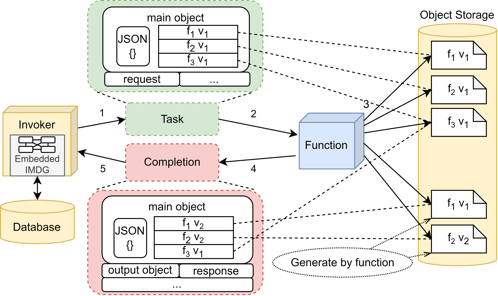

= Functions Development Guide
:toc:
:toc-placement: preamble
:toclevels: 2

== Concepts

.Class representation
image::diagrams/oaas_class_representation_v2.dio.png[]

.Invocation offloading

== Python Guide

=== Project Setup

=== Task Handling

=== Unstructured Data Access
