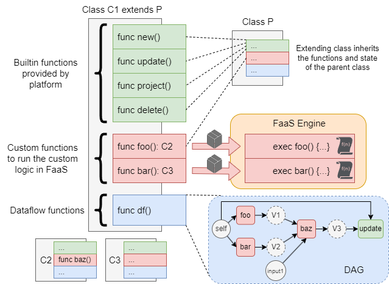

= Package Definition References
:toc:
:toc-placement: preamble
:toclevels: 2

== Concepts

.Class representation

== Package Structure

[source,yaml]
----
name: <name>
functions:
  - <function definition>
  - ...
classes:
  - <class definition>
  - ...
----

== Class Structure
[source,yaml]
----
classes:
  - name: <class name>
    stateType: <FILES or COLLECTION>
    stateSpec: # unstructured state declaration
      keySpecs:
        - name: <key name>
          access: <access modifier>
        - ...
    parents: # list of parent classes to inherit from
      - <parent class>
    functions: # List of instance function
      - name: <name of instance function> #this is for calling
        access: <access modifier>
        function: <<package.key> of the function> #This is for referencing the actual function definition
        outputCls: <<package.key> of output class> # overriding the output cls by function definition
        immutable: <boolean> #true for force immutable
        noMain: <boolean> #true for allowing the function to be called at class level (similar to static function in Java)
      - ...
----

== Function Structure

[source,yaml]
----
functions:
  - name: <function name>
    outputCls: <<package.key> of output class>
    description: <any description for this function> #Only for documenting
    type: <type of function [TASK, LOGICAL, MACRO, CHAIN] [default: CHAIN]>
    outputCls: <default class of the output object> # can be override by class definition
    provision: # configure the engine for deploying this function
      knative: # if using Knative
        image: <container image tag>
        env:  # key-value map to environment varible of deployment container
          <key>: <value>

  - name: <function name>
    ...
    provision:
      deployment: # if using Kubernetes deployment
        image: <container image tag>
        replica: <number of pods>
        port: <port number>
        pullPolicy: <image pull policy> # set to 'IfNotPresent' to disable image pull if exists
        env:  # key-value map to environment varible of deployment container
          <key>: <value>

  - name: <function name>
    ...
    provision:
      staticUrl: # if using nothing. Only if you host it on yourown.
        url: <url to function>

----

== Available built-in Functions

=== builtin.new

== Available built-in class

=== builtin.base
This class

== Dataflow Definitions

TODO
